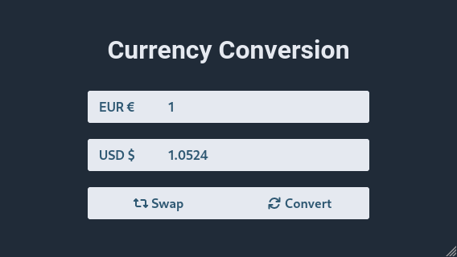
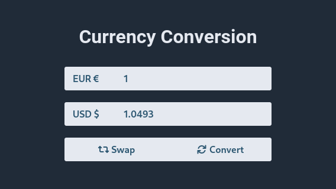

# Exercises

Thank you for taking the time to take this test. Please ask us any question about it.

The code of this test will be written in a Git repository and zipped, the first commit must be the project as provided. Try to not write the entire test in one commit and version it as much as you can. For us, understanding your progress is valuable.

For the resolution of the exercises it is only allowed to use the dependencies currently specified in the project, otherwise feel free to make all the necessary changes to the base project to achieve the stated goals.

## Backend

 1. The [moneyconvert.net](https://moneyconvert.net) API data is updated hourly or daily depending on the data source, however our backend requests it every time a request is made to the `rate` endpoint. To optimize resource usage, implement an in-memory cache of the exchange rates for the current hour, so that this information only needs to be retrieved for the first request of every hour.

 2. There is a `currencies` endpoint created, but it is not returning data. Complete its functionality to return the list of currencies that the `rate` endpoint supports conforming the OpenAPI schema. The data should be obtained dynamically, preferably reusing part of the code that the `rate` endpoint uses.

 3. The request to the [moneyconvert.net](https://moneyconvert.net) API is made asynchronously, after implementing the cache to this request you will need to check that there are no race conditions and the data is only fetched once in case multiple users make concurrent requests to any endpoint and there is no cache yet.

## Frontend

 1. The backend API exposes a `currencies` endpoint that returns the list of supported currencies, however our frontend is not making use of this and instead uses a static list. Refactor this code to populate the list on page load.

 2. The backend implements a rate limit system to prevent abuse. When this rate limit is reached, a `429 Too Many Requests` response code is returned and an `X-Ratelimit-Reset` header indicates the remaining seconds until the limit is reset. If the user continues making requests, a `403 Forbidden` response code is returned. The frontend must detect when a `403` or `429` response code is returned and disable the button and form submission for the seconds specified by this header.

    

 3. To improve the user experience, the text of the two numeric inputs must be automatically selected when the user clicks or focuses on them.

    

 4. As you can see in the following screenshots, the borders of the form elements have a radius applied but if two or more elements are adjacent this radius is zero to give the appearance that they are joined. Make the necessary changes to the styles to accomplish this result.

    **Before:**  
    

    **After:**  
    
