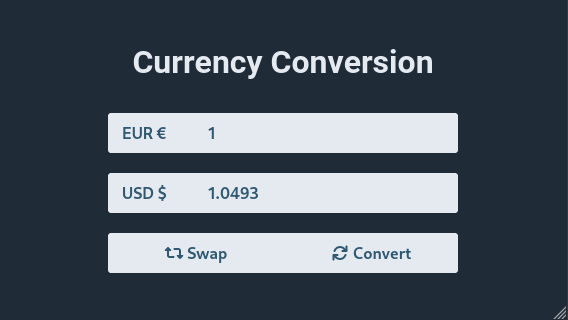

# Currency Conversion App

> Demo application to be used as a basis for a selection process.

The application is comprised of a backend with Node.js and Fastify that exposes an API (defined with OpenAPI 3.0) that provides the exchange rates from the European Central Bank (ECB) and a frontend with Vue 3 and SASS that performs the currency conversions.



# Development workflow

The project is structured as a monorepo and managed with the [pnpm](https://pnpm.io) package manager. In the `./packages/` directory are located the packages that constitute the project, `backend` and `frontend` in this case.

## Prerequisites

 * Linux, macOS or Windows.
 * Git (Windows version can be obtained from [gitforwindows.org](https://gitforwindows.org)).
 * [Node.js](https://nodejs.org) 18.x or higher.
 * [pnpm](https://pnpm.io) 8.x or higher.
 * Although not a requirement, [Visual Studio Code](https://code.visualstudio.com) with the following extensions is recommended for a better development experience:
   * [ESLint](https://marketplace.visualstudio.com/items?itemName=dbaeumer.vscode-eslint)
   * [Prettier](https://marketplace.visualstudio.com/items?itemName=esbenp.prettier-vscode)
   * [Vue Language Features (Volar)](https://marketplace.visualstudio.com/items?itemName=Vue.volar)

## Instructions

 1. Install project dependencies.

    ```sh
    pnpm install
    ```

 2. Run development web servers (with hot reload support).

    ```sh
    pnpm run dev
    ```

    * **Backend:** [http://localhost:5000/v1/documentation/](http://localhost:5000/v1/documentation/)
    * **Frontend:** [http://localhost:5173](http://localhost:5173)

    It is also possible to `cd` to the directory of each package and run this same command to have the log on different terminals.
